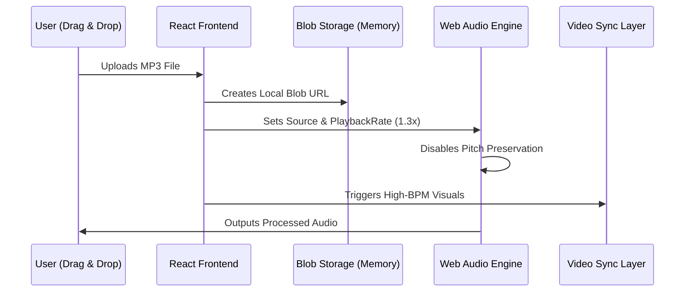
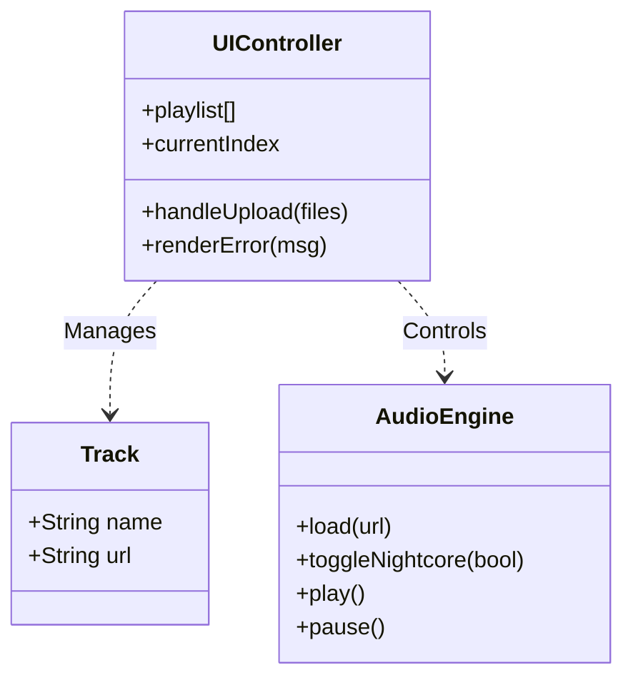
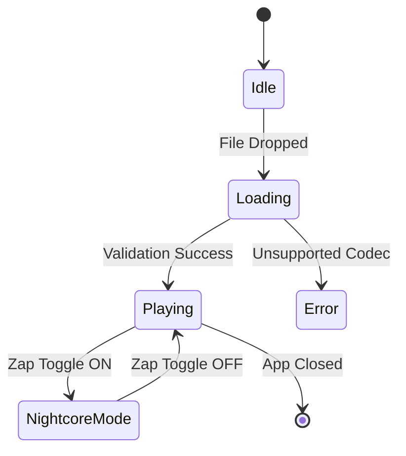

# 🎀 Nightcore Desktop Player

An end-to-end desktop audio engineering project designed to transform standard music into high-energy Nightcore in real-time. This project simulates a professional Software Engineering workflow: combining complex audio signal processing with a high-performance cross-platform desktop architecture.

> **Note**: This application started as a joke with a childhood friend, a nostalgic tribute to the music we used to blast back in middle school. It has since evolved into a robust technical demonstration of real-time audio manipulation.

## Overview

The platform provides a seamless "plug-and-play" experience for audio enthusiasts, transforming raw local MP3 files into the iconic Nightcore sound—characterized by increased tempo and higher pitch—through a hardware-accelerated Electron interface.

## Tech Stack

- Framework: Electron (Cross-platform Desktop)
- Frontend: React.js with TypeScript
- Audio Engine: Web Audio API (Real-time DSP)
- Icons: Lucide-React
- Bundler: Webpack
- Styling: CSS3 with Cyber-neon aesthetics

## Architecture

### Audio Processing Chain (Sequence Diagram)

1. Data Ingestion: Users interact via a "Security-First" file input or Drag & Drop. The application generates temporary Blob URLs to bypass local filesystem access restrictions while maintaining high performance.

2. Validation Layer:
    - Enforces audio-only MIME type validation.
    - Sanitizes file names to prevent UI breaking or injection attempts.

3. Real-Time DSP (Digital Signal Processing):
    - Tempo Acceleration: Increases playback speed to exactly 1.3x.
    - Pitch Shifting: By disabling the preservesPitch property on the audio context, the frequency increases naturally with the speed, creating the authentic Nightcore effect.
4. Synchronization Layer: A centralized state manager ensures that the animated anime visuals (MP4/GIF) perfectly match the BPM shift of the current audio track.

## Key Features: Advanced Audio Delivery

- Real-Time Nightcore Engine: Dynamic switching between standard and Nightcore modes without needing to re-buffer or reload the file.
- Kawaii Aesthetics: A fully custom-themed CSS "Cyber-Neon" window with frameless transparency support.
- Dynamic Playlist Management: Real-time queueing system with index tracking and automatic "Next Track" triggering upon audio completion.
- Context-Aware Visuals: High-definition video backgrounds that switch based on the processing mode to reflect the energy of the music.

## Application State Logic (State Diagram)

## Getting Started

- Clone the repository.
- Install dependencies: npm install
- Start the development environment: npm start
- Package the app for production: npm run make

## Project Structure

- src/main.ts: Electron main process (Window management, security settings).
- src/App.tsx: React core logic (State management, audio chain, UI).
- src/assets/: Static media assets including mode-specific anime visuals.
- src/declarations.d.ts: TypeScript definitions for non-code assets (MP4, MP3).
- index.html: The entry point with strict CSP meta-tags.
